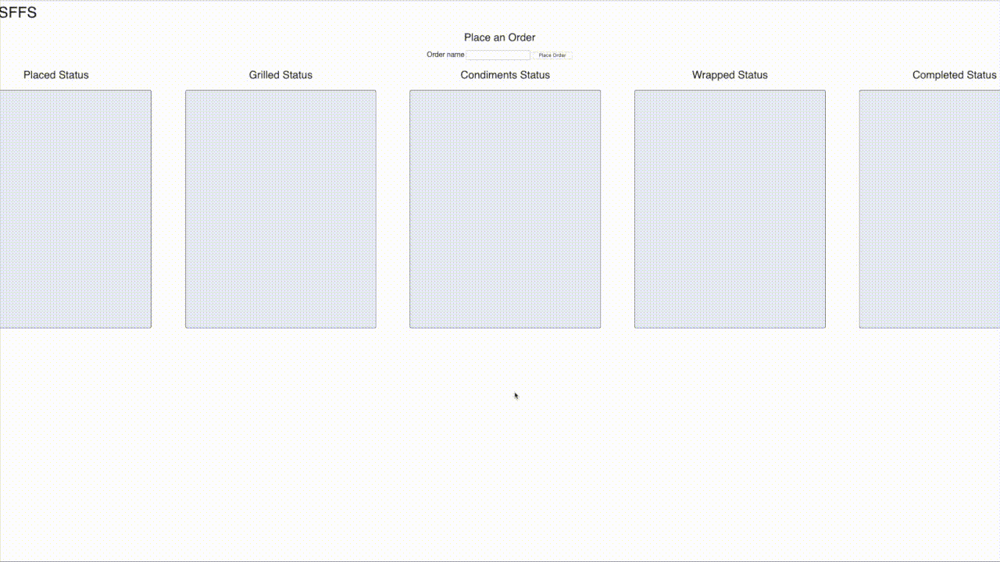
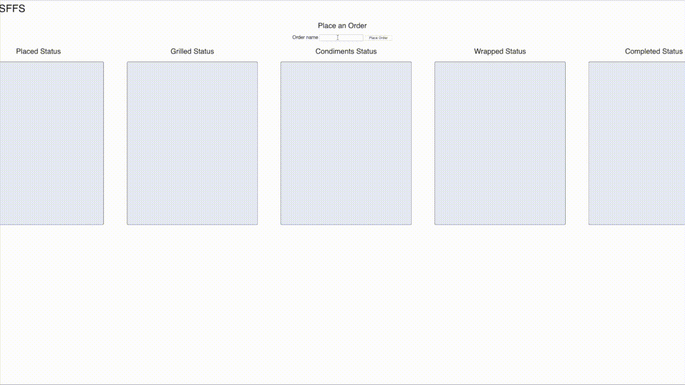
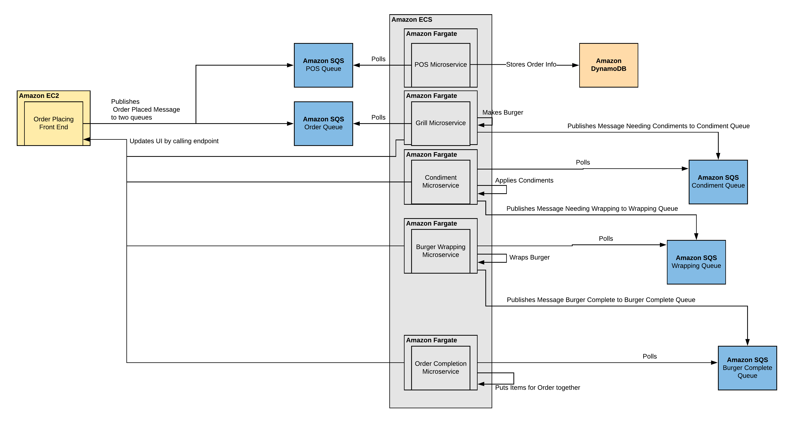
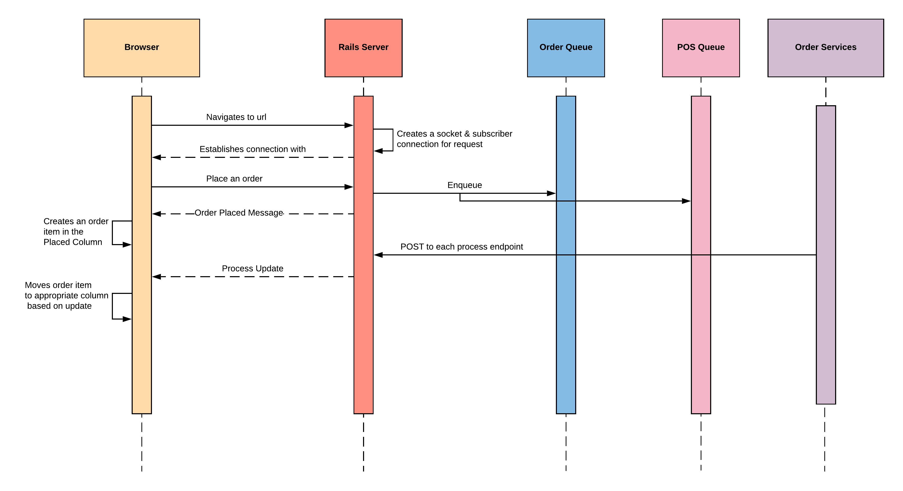
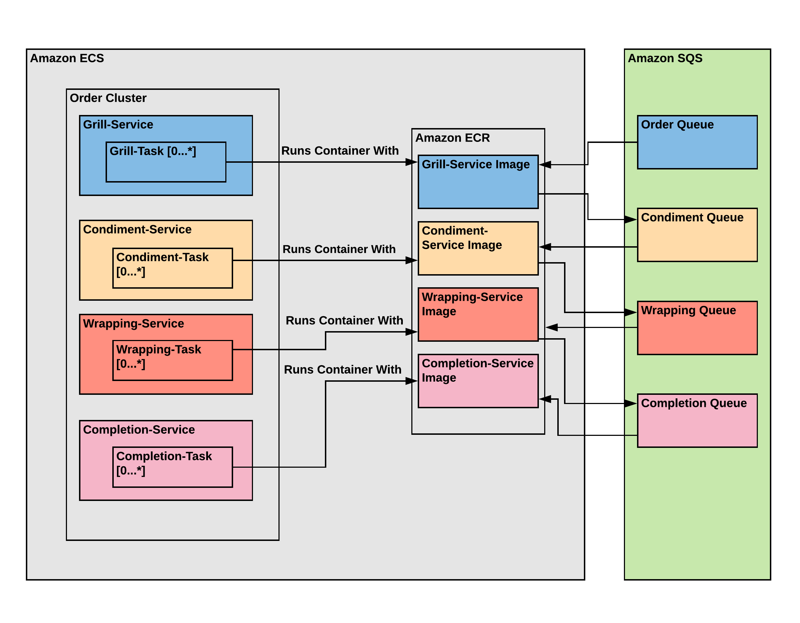

# burger-order-microservice

Team project for SWEN-549 - Engineering Cloud Software Systems.

## Description
This is a proof of concept and simulation in how AWS auto-scaling can be used to scale microservices and improve the time to complete well-defined tasks/workflows. A fast food order example was used for the simulation. See below for the demo.

All technical design documentation and presentations can be found in a privately shared Google Drive.

## Demo
In this demonstration, we show how long it takes to complete orders before and after auto-scaling kicks in. Each order is timed at the end with how long it took to complete. Each clip is scaled at 4x the original speed.

### Before

Orders are entered and sequentially completed by each service running a single task.

### After

Once enough orders are queued on a service, the CloudWatch metric triggers. This causes ECS to start scaling the Fargate instances to run more than a single task.

## System Design

### Architecture

The architecture is composed of the user-facing frontend browser interface that is served on an EC2 instance. The frontend's job is to place orders and allow for updates using Rail's Action Cable WebSockets integration.

The backend is composed of SQS, DynamoDB and the microservices. When an order is placed, a job gets sent to SQS and is logged to DynamoDB. Each service has a separate SQS queue that will poll jobs off to complete. Once a service is done, it knows to send the job to the next service by requeuing the job to the appropriate queue. This also sends an update to the frontend to be able to view the current status of a specific order.

The diagram above depicts at a high-level how the backend microservices update the browser once an order is launched.

Shown here is how the microservices scale in an ECS container. Each service is built-on a Docker image hosted on ECR. These images have knowledge of the corresponding SQS job queue. The tasks within each service can pull off a job queue.
